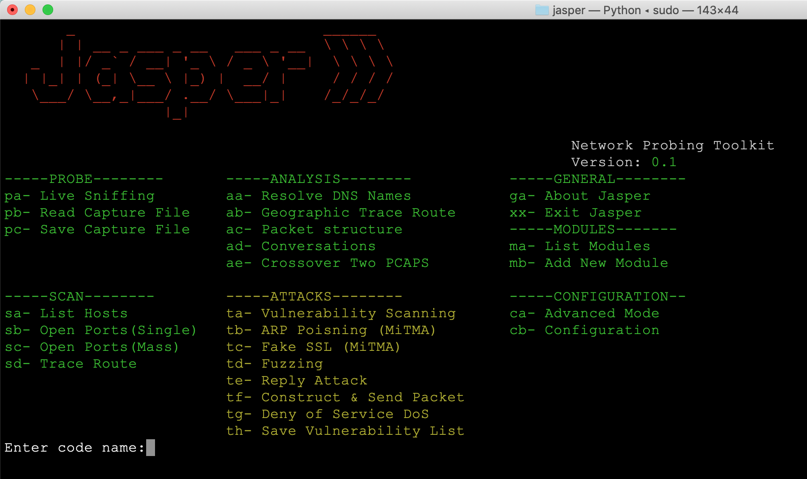

# JASPER
**Jasper** is simplified network probing toolkit that built on top of scapy library. The toolkit support the following functionalities:
* Probe
* Scan
* Analysis
* Attack `under developments`
* Modules `under developments`



### installing pre-requests:

```
pip3 install --pre scapy[complete]
pip3 install pyfiglet, termcolor, prettytable, keyboard,PyQt5
```
To run the application:
```
sudo python3 -E jasper.py

```
### Examples:
Listing all hosts in the network.


Acquiring information about certain IP address or domain name.


To scan the ip for open ports, either choosing the available online hosts in the network or entering specific IP address


Showing the traceroute path to reach specific IP address on map


